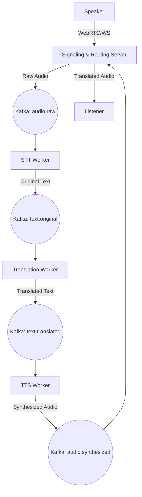

# Spoken 🎙️🌐

**"Speak your language, they hear theirs."**

Spoken is a real-time voice translation video conferencing platform. It eliminates language barriers in global professional collaborations by providing instantaneous, natural-sounding voice translation, allowing participants to communicate naturally in their native tongues.

---

## 🚀 Key Features

- **Near-Instantaneous Translation**: Targeted glass-to-glass latency of under 1.5 seconds.
- **Natural Voice Synthesis**: High-quality TTS that preserves the natural flow of conversation.
- **Zero-Friction Client**: Participants join via a secure link with no mandatory account creation for guests.
- **Intelligent Audio Routing**: An "SFU-Lite" logic for routing raw or translated audio based on individual language preferences.
- **Dual-Language Captions**: Real-time transcripts showing both original and translated text concurrently.
- **Professional Vocabulary**: Optimised for business, technical, and domain-specific context.

---

## 🛠️ Technical Stack

### **Backend (Python Implementation)**
- **Framework**: [FastAPI](https://fastapi.tiangolo.com/) (Asynchronous, high-concurrency architecture).
- **Data Persistence**: [PostgreSQL](https://www.postgresql.org/) with [SQLAlchemy 2.0](https://www.sqlalchemy.org/) (Async).
- **Migration Management**: [Alembic](https://alembic.sqlalchemy.org/) (Configured for asynchronous migrations).
- **Event Streaming**: [Apache Kafka](https://kafka.apache.org/) (Decoupled, event-driven audio processing pipeline).
- **Real-time Communication**: [WebSockets](https://fastapi.tiangolo.com/advanced/websockets/) for media signaling and caption streaming.
- **In-Memory Store**: [Redis](https://redis.io/) for live room state, participant sessions, and rate-limiting.

### **AI Infrastructure**
- **STT (Speech-to-Text)**: [Deepgram](https://www.deepgram.com/) / [OpenAI Whisper](https://openai.com/research/whisper) (High-accuracy streaming).
- **Machine Translation**: [DeepL API](https://www.deepl.com/pro-api) / [GPT-4o](https://openai.com/) (Context-aware translation).
- **TTS (Text-to-Speech)**: [Voice.ai](https://voice.ai/) (Natural audio synthesis).

---

## 📂 System Architecture

FluentMeet utilizes an event-driven pipeline to ensure minimal latency and high scalability:

1.  **Ingest**: Speaker's audio is captured via WebRTC and streamed over WebSockets to the Backend.
2.  **STT**: Raw audio chunks are pushed to Kafka (`audio.raw`), consumed by STT workers, and converted to text.
3.  **Translation**: Original text is pushed to Kafka (`text.original`), consumed by Translation workers, and converted to the target language.
4.  **TTS**: Translated text is pushed to Kafka (`text.translated`), consumed by TTS workers, and synthesized into target audio.
5.  **Egress**: Synthesized audio is pushed back to Kafka (`audio.synthesized`) and routed via WebSockets to listeners who require that language.



---

## 🏁 Installation & Setup

### **1. Prerequisites**
- Python 3.11+
- [Docker](https://www.docker.com/) and [Docker Compose](https://docs.docker.com/compose/)
- Access to Deepgram, DeepL, and Voice.ai APIs (API Keys needed).

### **2. Cloning the Repository**
```bash
git clone <repository-url>
cd spoken-api
```

### **3. Environment Configuration**
Copy the example environment file and fill in your credentials:
```bash
cp .env.example .env
```
Generate a secure `SECRET_KEY` for JWT:
```bash
python -c "import secrets; print(secrets.token_hex(32))"
```

### **4. Local Development Setup**
It is highly recommended to use a virtual environment:
```bash
python -m venv .venv
source .venv/bin/activate  # On Windows: .venv\Scripts\activate
pip install -r requirements.txt
```

### **5. Infrastructure Setup (Docker)**
Start the required infrastructure (PostgreSQL, Redis, Kafka, Zookeeper):
```bash
docker-compose up -d
```

### **6. Database Migrations**
Initialize the database schema using Alembic:
```bash
alembic upgrade head
```

---

## 🚀 Running the Application

### **Start the Backend**
```bash
uvicorn app.main:app --reload
```
The API will be available at `http://localhost:8000`. You can access the interactive API documentation (Swagger UI) at `http://localhost:8000/docs`.

---
## Database Models Setup with SQLAlchemy 2.0 (Async)
### **Defining Models**
```bash
Create your SQLAlchemy models in `app/models.py` using the async syntax.
```
### **Registering Models with Alembic**
```bash
Ensure your models are imported in `app/models/init.py` for Alembic to detect them during migrations.
```

### **Creating Migrations**
```bash
python -m alembic revision --autogenerate -m "Add avatar url to users"
```
### **Migrate Head**
```bash
alembic upgrade head
```

### **Applying Migrations**
```bash
python -m alembic upgrade head
```

---

## 🧪 Testing & Quality Assurance

### **Running Tests**
```bash
pytest
```

### **Test Coverage**
Generate and view a coverage report:
```bash
pytest tests/ -v --cov=app --cov-report=html --cov-report=term
# Open htmlcov/index.html in your browser
```

---

## 🛡️ Security & Compliance

- **Authentication**: JWT-based authentication with `HttpOnly`, `Secure`, `SameSite=Strict` cookies for Refresh Tokens.
- **Data Privacy**: Ephemeral audio/text processing; no data is persisted after the meeting ends.
- **Rate Limiting**: Redis-backed throttling to manage API costs and prevent abuse.
- **Soft-Delete**: Strict account deletion policies preventing reactivation via login.

---

## Linting & Formatting
- **Black**: Enforce consistent code formatting.
```bash
black .
```
- **isort**: Sort imports for readability.
```bash
isort .
```
- **ruff**: Linting for code quality and style.
```bash
ruff .
```
```bash
python -m ruff check .
ruff format .
```

---

## Logging Safety

To prevent log injection and control-character pollution from user-provided inputs,
FluentMeet sanitizes dynamic log arguments with `app/core/sanitize.py`.

- Use `sanitize_for_log(value)` for a single value.
- Use `sanitize_log_args(*values)` when logging multiple placeholders.
- Newline, carriage return, tab, and other control characters are escaped or replaced.
- Long values are truncated with `...<truncated>`.

## 🤝 Contributing

We welcome contributions! Please follow these steps:
1.  Fork the repository.
2.  Create your feature branch (`git checkout -b feature/AmazingFeature`).
3.  Ensure your code follows [Black](https://github.com/psf/black) and [isort](https://github.com/PyCQA/isort) formatting.
4.  Commit your changes (`git commit -m 'Add some AmazingFeature'`).
5.  Push to the branch (`git push origin feature/AmazingFeature`).
6.  Open a Pull Request.

---

## 📄 License

This project is licensed under the MIT License - see the [LICENSE](LICENSE) file for details.
